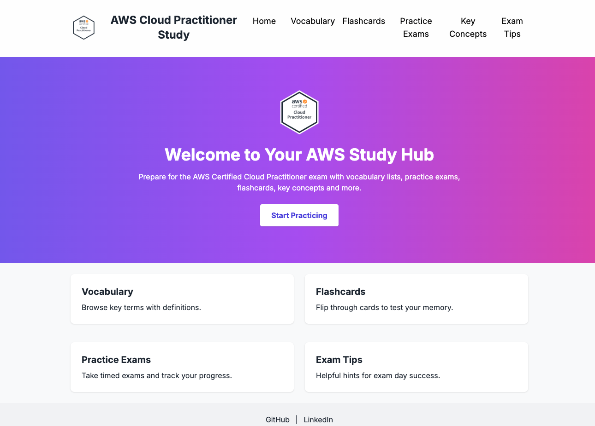

# 🌩️ AWS Cloud Quizlet

A modern and interactive study hub to prepare for the **AWS Certified Cloud Practitioner (CLF-C02)** exam. This web app includes vocabulary definitions, flashcards, a full exam simulator, and structured key concepts.

---

## 🔍 Features

- ✅ Vocabulary list with categories (loaded from JSON)
- 🎴 Flashcards with flip, shuffle, and next/previous controls
- 📝 Practice Exams with 50 timed questions and results
- 📘 Key Concepts organized by domain (Cloud, Security, Pricing, etc.)
- 💡 Exam Tips, structure, and strategy for CLF-C02

---

## 🌐 Live Preview

👉 [Visit the website](https://cmontilha.github.io/aws-cloud-quizlet)

  

---

## 📘 License

This project is open-source and available under the [MIT License](LICENSE).