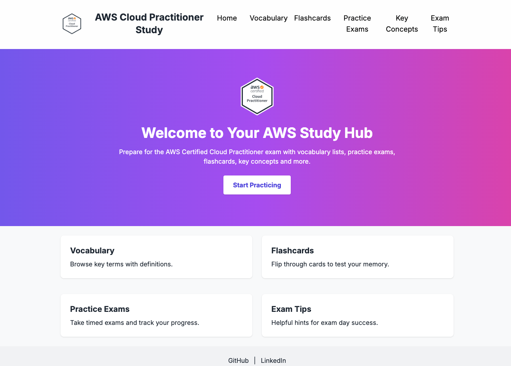

# 🌩️ AWS Cloud Quizlet

A modern and interactive study hub to prepare for the **AWS Certified Cloud Practitioner (CLF-C02)** exam. This web app includes vocabulary definitions, flashcards, a full exam simulator, and structured key concepts.

---

## 🔍 Features

- ✅ Vocabulary list with categories (loaded from JSON)
- 🎴 Flashcards with flip, shuffle, and next/previous controls
- 📝 Practice Exams with 50 timed questions and results
- 📘 Key Concepts organized by domain (Cloud, Security, Pricing, etc.)
- 💡 Exam Tips, structure, and strategy for CLF-C02
- 🔐 Login and signup with Appwrite Cloud

---

## 🔐 Appwrite Authentication

### 1) `.env` location

The `.env` file must be in the project root:

- `/Users/cmontilha/Personal Documents/CS Projects/aws-cloud-quizlet/.env`

Create it from the example:

```bash
cp .env.example .env
```

Default values for your project are already in `.env.example`:

- `APPWRITE_ENDPOINT=https://nyc.cloud.appwrite.io/v1`
- `APPWRITE_PROJECT_ID=69b443ad0007ac25103a`

### 2) Frontend runtime config

Generate `appwrite-config.json` (used by browser code) from `.env`:

```bash
./scripts/generate-appwrite-config.sh
```

### 3) Database migration (Appwrite)

Fill `APPWRITE_API_KEY` in `.env` with a server key that has Databases/Collections scopes, then run:

```bash
./migrations/001_create_appwrite_database.sh
```

This migration creates:

- Database: `APPWRITE_DB_ID` (default: `aws_cloud_quizlet`)
- Collection: `APPWRITE_COLLECTION_PROGRESS_ID` (default: `user_progress`)
- Attributes: `userId`, `examId`, `score`, `takenAt`

### 4) Appwrite Console check

In your Appwrite project, ensure:

- Email/Password auth is enabled
- A Web platform exists with your local origin (example: `http://localhost:8000`)

---

## 🌐 Live Preview

👉 [Visit the website](https://cmontilha.github.io/aws-cloud-quizlet)

<p align="left">
  
</p>

---

## 📘 License

This project is open-source and available under the [MIT License](LICENSE).
